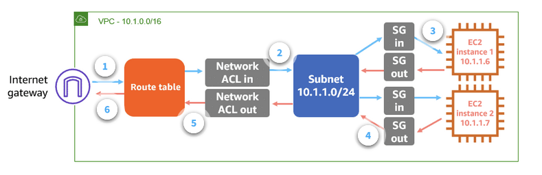

# Can you show how AWS Security Group & Network ACLs work?

## 🔥 Scenario

As the newly joined AWS Engineer your manager is asking you to quickly show how AWS Security Groups and Network ACLs work to protect EC2 machines. Can you help your manager gain this understanding?

## 🎯Solutions

You can present your manager this diagram to show the data flow from internet gateway to the EC2 machines.

## 📌 Who is using this

This repository teaches developers, Solution Architects & Ops Engineers how to build complete architecture in AWS. Based on that knowledge these Udemy [course #1][103], [course #2][102] have been created to enhance your skills.

### 💡 Help/Suggestions or 🐛 Bugs

Thank you for your interest in contributing to our project. Whether it is a bug report, new feature, correction, or additional documentation or solutions, we greatly value feedback and contributions from our community. [Start here](/issues)

### 👋 Buy me a coffee

 Buy me a [coffee ☕][900].

### 📚 References

1. [AWS real time use cases to test your skills][1]

### 🏷️ Metadata

**Level**: 100

[1]: https://github.com/miztiik/aws-real-time-use-cases
[100]: https://www.udemy.com/course/aws-cloud-security/?referralCode=B7F1B6C78B45ADAF77A9
[101]: https://www.udemy.com/course/aws-cloud-security-proactive-way/?referralCode=71DC542AD4481309A441
[102]: https://www.udemy.com/course/aws-cloud-development-kit-from-beginner-to-professional/?referralCode=E15D7FB64E417C547579
[103]: https://www.udemy.com/course/aws-cloudformation-basics?referralCode=93AD3B1530BC871093D6
[899]: https://www.udemy.com/user/n-kumar/
[900]: https://ko-fi.com/miztiik
[901]: https://ko-fi.com/Q5Q41QDGK
