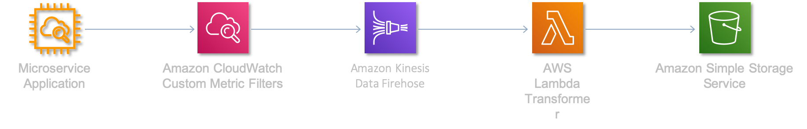

# Lambda Request Response Payload Errors

## 🔥 Scenario

Your customer has the following setup,
> Microservice Application logs -> CloudWatch Logs -> Subscription with filter -> Kinesis Firehose -> Transformation Lambda -> S3



You customer is reporting they are getting errors. Upon looking into the lamdba logs, they are seeing this entry

```log
Execution failed ... payload is too large ...
```

They have tried to lower the buffer for the lambda in the Firehose stream configuration to be at it's minimum - `1MB` . However, even with just `1MB` of request data, the unzipped processed output turns out to be larger than what Lambda expects.

What are their options to fix this issue ?

## 📋 Next Steps

1. What actions will you take?
1. How will you test your solution?
1. Can you automate its deployment and improve its re-usability as a bonus feature?

## 🎯Solutions

- Check the Lambda [docs][1] for the limits
- Check if they can split the response payload before storing in S3

## 👋 Buy me a coffee

Buy me a coffee ☕ through [Paypal](https://paypal.me/valaxy), _or_ You can reach out to get more details through [here](https://youtube.com/c/valaxytechnologies/about).

### ℹ️ Metadata

**Level**: 200

[1]: https://docs.aws.amazon.com/lambda/latest/dg/gettingstarted-limits.html
