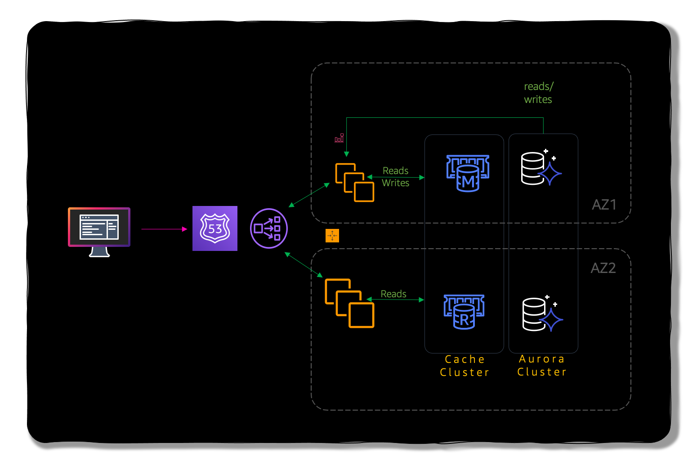

# What are some best practices in caching?

## 🔥 Scenario

Mystique Corp is developing a cloud native application. They would like to use redis for caching to improve the performance of the application. They are looking for some guidance on what are redis caching best practices.

As their cloud consultant can you assist them?.

## 🎯 Solutions

- Avoid very short key names - while lengthening a name does adds bytes, it also simplifies app development when key names are predictable
- Create a logical schema such as: [Object]:[value]. Use colon rather than `.` or `-`
- Hashes, Lists, Sets are encoded to be much more efficient - use them!
- Avoid small Strings values given the overhead of the data type. Otherwise use Hashes.
- Avoid `KEYS` command and other long running commands
- Max Key Size, Max Value Size = 512MB
- List, Sets, Hashes size = 2^32-1

Finally consider these factors when architecting your redis clusters,

1. **Performance** – Performance should not be compromised
   1. Benchmark operations per second , latency and factor the time complexity of key operations.
      - Use pipelining for Bulk Reads/Writes – can produce ~1M operations/second per node
      - Time complexity (BigO) with Redis data structures has direct impact to performance
      - Chose HIGH Network performance instances when needed and newest Intel processors when available
1. Storage – Clusters should have adequate Memory
   - Recommended: Memory needed + 25% reserved memory (for Redis) + some room for growth (optional). Key - management including proper selection of eviction policies and TTLs should be used.
   - Scale up or out when needed
1. Cluster Isolation – Chose a strategy that works for your workload
   - Identify what kind of isolation is needed based on the workload and environment
   - Cost WRT Isolation: No Isolation \\\\\$ | Isolation by Purpose \\\\\$\\\\\$ | Full Isolation \\\\\$\\\\\\$\$
1. SLAs – Architect with your SLAs in mind
   - Different Redis topologies offer different features including: failover times, total throughput, etc.

## 📌 Who is using this

This repository teaches developers, Solution Architects & Ops Engineers how to build complete architecture in AWS. Based on that knowledge these Udemy [course #1][103], [course #2][102] have been created to enhance your skills.

### 💡 Help/Suggestions or 🐛 Bugs

Thank you for your interest in contributing to our project. Whether it's a bug report, new feature, correction, or additional documentation or solutions, we greatly value feedback and contributions from our community. [Start here](/issues)

### 👋 Buy me a coffee

Buy me a [coffee ☕][900].

### 📚 References

1. [AWS real time use cases to test your skills][1]

### 🏷️ Metadata

**Level**: 300

[1]: https://github.com/miztiik/aws-real-time-use-cases
[100]: https://www.udemy.com/course/aws-cloud-security/?referralCode=B7F1B6C78B45ADAF77A9
[101]: https://www.udemy.com/course/aws-cloud-security-proactive-way/?referralCode=71DC542AD4481309A441
[102]: https://www.udemy.com/course/aws-cloud-development-kit-from-beginner-to-professional/?referralCode=E15D7FB64E417C547579
[103]: https://www.udemy.com/course/aws-cloudformation-basics?referralCode=93AD3B1530BC871093D6
[899]: https://www.udemy.com/user/n-kumar/
[900]: https://ko-fi.com/miztiik
[901]: https://ko-fi.com/Q5Q41QDGK
