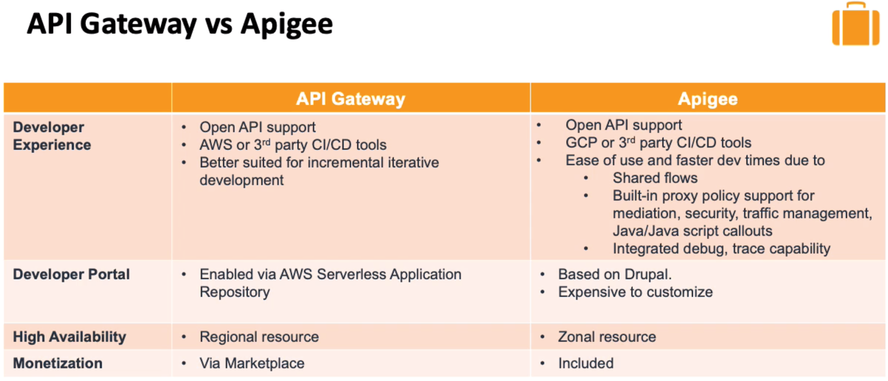

# BRIEF DESCRIPTION OF PROBLEM

## 🔥 Scenario

Mystique corporation is a born in the cloud organisation. Their application stack use multiple microservices and they are exposed to internal and external customers through APIs. As the organisation is growing at a face pace, they are looking for a nicer way to manage their API across the enterprise. As they have hosted most of their application stack in AWS, they have been using Amazon API Gateway. One of their developers heard good stories about Apigee and how good it is for managing their APIs.

As a cloud consultant, can you help them to draw up a comparison between these two services?

## 🎯Solutions

Both the services address a critical need in the market - Managing APIs and reduce developer pain. There are areas where each of the products shine better against the other. The following image illustrates their strengths.

The choice between these two will have be decided by defining the objective the organsiation wants to achieve.

## 📌 Who is using this

This repository teaches developers, Solution Architects & Ops Engineers how to build complete architecture in AWS. Based on that knowledge these Udemy [course #1][103], [course #2][102] have been created to enhance your skills.

### 💡 Help/Suggestions or 🐛 Bugs

Thank you for your interest in contributing to our project. Whether it's a bug report, new feature, correction, or additional documentation or solutions, we greatly value feedback and contributions from our community. [Start here][/issues]

### 👋 Buy me a coffee

Buy me a [coffee ☕][900].

### 📚 References

1. [AWS real time use cases to test your skills][1]

### 🏷️ Metadata

**Level**: 300

[1]: https://github.com/miztiik/aws-real-time-use-cases
[100]: https://www.udemy.com/course/aws-cloud-security/?referralCode=B7F1B6C78B45ADAF77A9
[101]: https://www.udemy.com/course/aws-cloud-security-proactive-way/?referralCode=71DC542AD4481309A441
[102]: https://www.udemy.com/course/aws-cloud-development-kit-from-beginner-to-professional/?referralCode=E15D7FB64E417C547579
[103]: https://www.udemy.com/course/aws-cloudformation-basics?referralCode=93AD3B1530BC871093D6
[899]: https://www.udemy.com/user/n-kumar/
[900]: https://ko-fi.com/miztiik
[901]: https://ko-fi.com/Q5Q41QDGK
