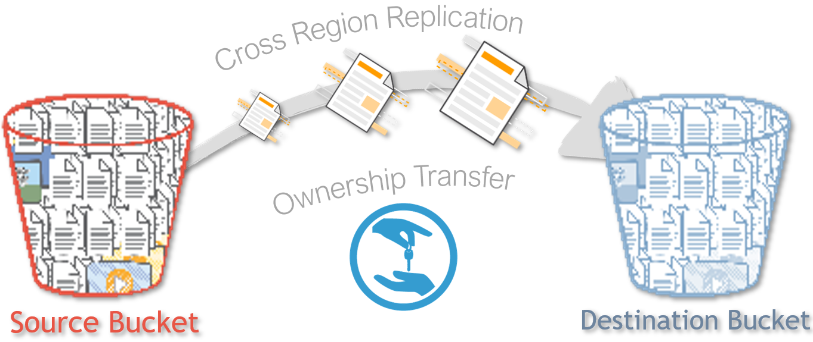

# Transfer ownership of Amazon S3 objects to a different AWS account

## ?? Scenario

Your client has a team of developers using `Account A` to create assets to be used in the production site hosted in `Account B`. As the cloud engineer your client expects you to set up automated copy of S3 Objects from `Account A` to S3 bucket in `Account B` and ensure that `Acccount B` can modify/change the permissions of the objects to suit their deployment requirements.



## Introduction

- Create SourceBucket in `Account A` for developers and DestinationBucket in  `Account B` for Production.
- Set up the bucket permissions in both`Source Bucket` and `Destination Bucket`
- The bucket permissions will allow any IAM users of `Account A` to upload objects into the `DestinationBucket`,along with `OWNERSHIP` transfer.
- Finally,the ACL has to be applied through CLI to provide `FULL CONTROL` of the objects to `Account B`.

1. ## Prerequisites

    - Two AWS Accounts
        - Source account:`Account A`
        - Destination Account:`Account B`
    - S3 Buckets in Account `A` & `B`
    - AWS CLI Access for both the accounts

1. ## Setup Tools

    Let’s prepare the two accounts. Ensure you have two buckets `sourcebucket` and `destinationbucket`. _Change to your bucket names_. Install and configure AWS CLI with two different profiles for Account `A` & `B`.

1. ## Source Account Bucket

     - Create a `sourcebucket` in a Region (eg.,Mumbai) ,in the `Account A`.
        - Upload sample files onto this bucket, that will be transferred to destination account.
        - Attach the below mentioned permissions into the Bucket policy;

        ```json
        {
          "Version": "2012-10-17",
          "Statement": [
            {
              "Sid": "Stmt1541018283275",
              "Effect": "Allow",
              "Principal": {
                "AWS": [
                  "arn:aws:iam::<<YOUR-DEV-ACCOUNT-NUMBER>>:user/<<iam-username>>"
                ]
              },
              "Action": [
                "s3:PutObject"
              ],
              "Resource": "arn:aws:s3:::<<YOUR-BUCKET-NAME>>/*",
              "Condition": {
                "StringEquals": {
                  "s3:x-amz-acl": "bucket-owner-full-control"
                }
              }
            }
          ],
          "Id": "Policy1541018284691"
        }
        ```

1. ## Destination Account Bucket

    - Create a `DestinationBucket` (_for example in Ireland Region_),in the `Account B`.
    - Attach the below mentioned permissions into the Bucket policy;

        ```json
        {
          "Version": "2008-10-17",
          "Statement": [
            {
              "Sid": "Stmt1357935647218",
              "Effect": "Allow",
              "Principal": {
                "AWS": "arn:aws:iam::<<YOUR-DEV-ACCOUNT-NUMBER>>:user/<<iam-username>>"
              },
              "Action": "s3:ListBucket",
              "Resource": "arn:aws:s3:::<<DESTINATION BUCKET NAME>>"
            },
            {
              "Sid": "Stmt1357935676138",
              "Effect": "Allow",
              "Principal": {
                "AWS": "arn:aws:iam::<<YOUR-DEV-ACCOUNT-NUMBER>>:user/<<iam-username>>"
              },
              "Action": "s3:PutObject",
              "Resource": "arn:aws:s3:::<<DESTINATION BUCKET NAME>>/*"
            }
          ],
          "Id": "Policy1357935677554"
        }
        ```

   **Note:** _The account numbers can be figured by going to the account's CONSOLE,
   then click SUPPORT, choose Support center and there you will find the account number as : `xxxxxxxxxxxx`_.

1. ## Verify S3 Copying & Ownership

    - Go to the AWS CLI, Configure AWS using the script : `aws configure`.
    - Transfer objects from the Source Bucket to Destination Bucket using the command as below:

      ```bash
      aws s3api put-object-acl --bucket {{YOUR-DESINTATION-BUCKET-NAME}} \
                               --key {{YOUR-OBJECT-NAME}} \
                               --acl bucket-owner-full-control
      ```

      - The above command will provide full control of the object to the bucket owner (Destination bucket owner).

      - If you want to copy multiple objects to the bucket, then try this command instead

        ```bash
        aws s3 cp s3://{{YOUR-SOURCE BUCKET NAME}}/  \
                  s3://{{YOUR-DESTINATION BUCKET NAME}}/  \
                  --acl bucket-owner-full-control \
                  --recursive
        ```

     - The above CLI scripts will copy all the S3 objects across AWS accounts, also ending up in transferring the `FULL CONTROLL` to the destination account.

### Contact Us

You can reach out to us to get more details through [here](https://youtube.com/c/valaxytechnologies/about).

#### ?? References

1. [Granting Cross Account Permissions](https://docs.aws.amazon.com/AmazonS3/latest/dev/example-bucket-policies.html#example-bucket-policies-use-case-8)
1. [S3 Cross Account Object Copying & Ownership Transfer](https://aws.amazon.com/premiumsupport/knowledge-center/s3-bucket-owner-access/)

## ?? Buy me a coffee

Buy me a coffee ? through [Paypal](https://paypal.me/valaxy), _or_ You can reach out to get more details through [here](https://youtube.com/c/valaxytechnologies/about).

### ?? Metadata

**Level**: 200
