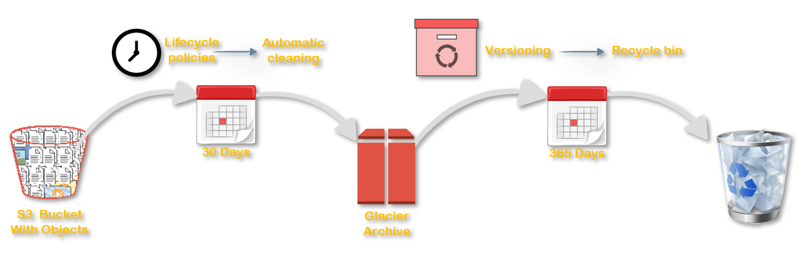

# S3 Cost Optimization

## Scenario

Your client uses s3 extensively to store data. Some of the buckets hold close to 5TB of data. Your client has already configured S3 Lifecycle Policies to move data to glacier to save on costs. But they are still facing a huge bill and it is growing all the time. They have contacted to suggest them ways to reduce their S3 bill.

## Next Steps

1. What actions will you take to ?
1. What order will you take those actions?
1. What controls will you put in place to prevent such events?

### Contact Us

You can reach out to us to get more details through [here](https://youtube.com/c/valaxytechnologies/about).
