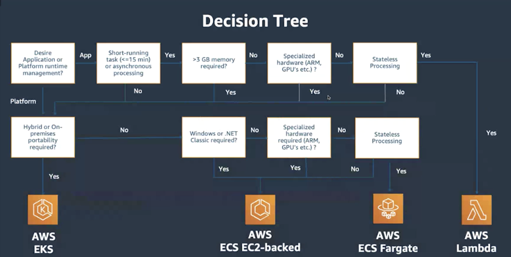

# AWS Lambda Or AWS Fargate

## 🔥 Scenario

Mystique Unicorn App wants to build a microservice. Their developers are excited to build theri app as an cloud native serverless application. During their research, they found that they can use both AWS Lambda & AWS Fargate to run their microservice. As both the services are serverless, they are looking for your guidance on the pros & cons of each services and best practice to follow in their architecture

Can you help them with your expert advices?

## 🎯Solutions

Here is a recommendation from AWS to make a decision on which service to use,

## 📌 Who is using this

This repository teaches developers, Solution Architects & Ops Engineers how to build complete architecture in AWS. Based on that knowledge these Udemy [course #1][103], [course #2][102] have been created to enhance your skills.

### 💡 Help/Suggestions or 🐛 Bugs

Thank you for your interest in contributing to our project. Whether it's a bug report, new feature, correction, or additional documentation or solutions, we greatly value feedback and contributions from our community. [Start here][200]

### 👋 Buy me a coffee

Buy me a [coffee ☕][900].

### 📚 References

1. [AWS real time use cases to test your skills][1]

### 🏷️ Metadata

**Level**: 300

[1]: https://github.com/miztiik/aws-real-time-use-cases
[100]: https://www.udemy.com/course/aws-cloud-security/?referralCode=B7F1B6C78B45ADAF77A9
[101]: https://www.udemy.com/course/aws-cloud-security-proactive-way/?referralCode=71DC542AD4481309A441
[102]: https://www.udemy.com/course/aws-cloud-development-kit-from-beginner-to-professional/?referralCode=E15D7FB64E417C547579
[103]: https://www.udemy.com/course/aws-cloudformation-basics?referralCode=93AD3B1530BC871093D6
[200]: https://github.com/miztiik/cfn-challenges/issues
[899]: https://www.udemy.com/user/n-kumar/
[900]: https://ko-fi.com/miztiik
[901]: https://ko-fi.com/Q5Q41QDGK
