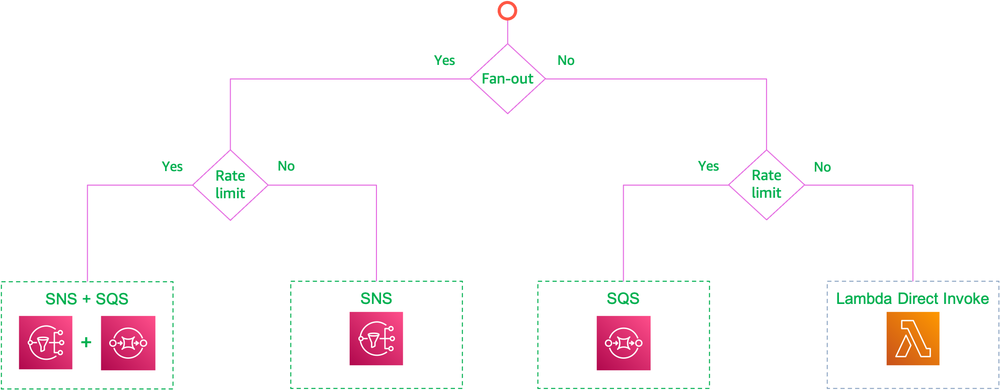

# When to choose SNS or SQS for your event driven architecture

## 🔥 Scenario

When you are developing new applications, one of the common questions that comes up is that, When to choose SQS or SNS for message delivery. 

## 🎯Solutions

Both SNS and SQS have their own benefits and are ideally suited for specific needs. It is not an either of choice, rather it is about choosing the right tool for the right job.

Here is a simple decision tree that makes it easier for new developers to get them thinking about the requirements that are important to them and follow along that path.

For example, If your architecture requires `fan-out` and `rate limiting` you can use a combination of both SNS (for fanout) and SQS (for rate limiting)

## 📌 Who is using this

This repository teaches developers, Solution Architects & Ops Engineers how to build complete architecture in AWS. Based on that knowledge these Udemy [course #1][103], [course #2][102] have been created to enhance your skills.

### 💡 Help/Suggestions or 🐛 Bugs

Thank you for your interest in contributing to our project. Whether it is a bug report, new feature, correction, or additional documentation or solutions, we greatly value feedback and contributions from our community. [Start here](/issues)

### 👋 Buy me a coffee

 Buy me a [coffee ☕][900].

### 📚 References

1. [AWS real time use cases to test your skills][1]

### 🏷️ Metadata

**Level**: 300

miztiik_automation_event_driven_sns_vs_sqs.png

[1]: https://github.com/miztiik/aws-real-time-use-cases
[100]: https://www.udemy.com/course/aws-cloud-security/?referralCode=B7F1B6C78B45ADAF77A9
[101]: https://www.udemy.com/course/aws-cloud-security-proactive-way/?referralCode=71DC542AD4481309A441
[102]: https://www.udemy.com/course/aws-cloud-development-kit-from-beginner-to-professional/?referralCode=E15D7FB64E417C547579
[103]: https://www.udemy.com/course/aws-cloudformation-basics?referralCode=93AD3B1530BC871093D6
[899]: https://www.udemy.com/user/n-kumar/
[900]: https://ko-fi.com/miztiik
[901]: https://ko-fi.com/Q5Q41QDGK
