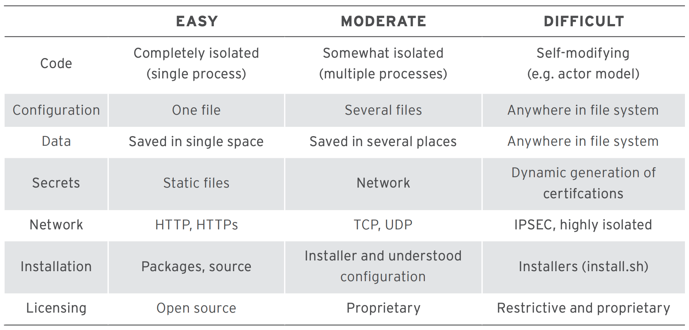

# Migrate To Containers

## 🔥 Scenario

Mystique Unicorn App is looking to modernise their application stack. They have few applications running in their onprem data centres and considering to move them to containers. Before they begin, They would like to know the best practices when running applications inside containers.

As you are their containers expert, Mystique Unicorn seeks your advice. Can you help them?

## 🎯 Solutions

When thinking about migrating applications into containers, approach containers with the mindset that your application is made up of smaller units, and the packaging of those units into something easily consumable. This will make your containerized application easier to understand, deploy, and maintain.
You need to look at your application and think about each of the pieces and how they work together—similar to the way you can break up a program into a series of classes and functions.

Applications have specific requirements have to be understood from their architectural, security, and performance perspectives

### 📐 Architecture

From an architectural perspective to move applications into containers, At a minimum, you must be able to answer the following questions:

1. Where are the binaries for this application? Can you automate the installation and configuration?

   - Use layers—think about core builds and application runtime layers
   - Identify dependencies and determine if previous layers should contain the dependencies, especially if they can be shared or used by other applications.
   - Identify how the binaries will be started: script, systemd, etc.

1. Where does all of the configuration data reside? (_For ex: Date, Time, Locale settings_)
1. Does the application requires changes to kernel parameters (`/proc/sys`) or access to
   special hardware.
1. Where does the application store its state data?
1. What kind of data classification does this application process?
1. What kind of network access does this application need?
1. Does the application's licensing allow you to easily distribute the application inside of a container image?

### 👮 Security

You can refer this blog for knowing more about securing your containers[1].

### Performance

Containers are linux processes that use technologies, such as control groups (cgroups), SecurityEnhanced Linux (SELinux), and namespaces to provide a higher level of isolation to applications. This allows them to run at native or near native speed.

- Workloads must also be analyzed for performance

### 💡 Help/Suggestions or 🐛 Bugs

Thank you for your interest in contributing to our project. Whether it's a bug report, new feature, correction, or additional documentation or solutions, we greatly value feedback and contributions from our community. [Start here][200]

## 📌 Who is using this

This repository teaches developers, Solution Architects & Ops Engineers how to build complete architecture in AWS. Based on that knowledge these Udemy [course #1][103], [course #2][102] have been created to enhance your skills.

### 💡 Help/Suggestions or 🐛 Bugs

Thank you for your interest in contributing to our project. Whether it's a bug report, new feature, correction, or additional documentation or solutions, we greatly value feedback and contributions from our community. [Start here][200]

### 👋 Buy me a coffee

Buy me a [coffee ☕][900].

### 📚 References

1. [Miztiik Blogs - Container Security][1]

### 🏷️ Metadata

**Level**: 200

[1]: https://github.com/miztiik/aws-real-time-use-cases/tree/master/300-Security-Containers
[101]: https://www.udemy.com/course/aws-cloud-security-proactive-way/?referralCode=71DC542AD4481309A441
[102]: https://www.udemy.com/course/aws-cloud-development-kit-from-beginner-to-professional/?referralCode=E15D7FB64E417C547579
[103]: https://www.udemy.com/course/aws-cloudformation-basics?referralCode=93AD3B1530BC871093D6
[200]: https://github.com/miztiik/aws-real-time-use-cases/issues
[899]: https://www.udemy.com/user/n-kumar/
[900]: https://ko-fi.com/miztiik
[901]: https://ko-fi.com/Q5Q41QDGK
