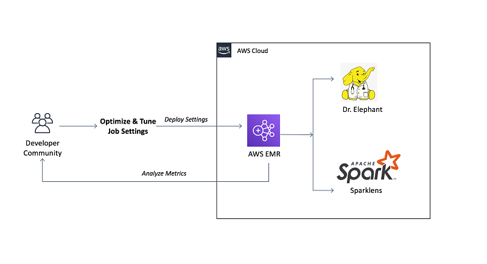

# Optimised Compute for Data Extraction, Transformation & Loading(ETL)

- Dr.Elephant
- SparkLens - built in - scaler/ scheduler

## 🔥 Scenario

Miztiik Corp is a global organisation. Everyday they process millions of events and store them in their data lake. The data processing of these events happen in a CI/CD environment. The data engineering team is facing cost pressure and have been asked to look at way to optimize their operations. On investigating high cost services, they have found most of their cost is attributed to compute used by the Spark Clusters. One of the crucial tasks of data processing is extracting and flattening nested data using Apache Spark in AWS EMR.

They are looking for guidance on what are the best practices in optimizing their Spark Clusters.

## 🎯Solutions

We have two open-source[1][1] tools to help us to optimize our EMR Clusters,

- **Sparklens**: with its built-in Spark scheduler simulator has a primary goal to understand the scalability limits of Spark applications. It helps in understanding how efficiently a given Spark application is using the compute resources provided to it.

  Sparklens looks at runs of your application and helps you to narrow down to few stages (or driver, or skew or lack of tasks) which are limiting your application from scaling out and provides contextual information about what could be going wrong with these stages.

  

- **Dr. Elephant** is a performance monitoring and tuning tool for Hadoop and Spark. It analyses the Hadoop and Spark jobs using a set of pluggable, configurable, rule-based heuristics that provide insights on how a job performed, and then uses the results to make suggestions about how to tune the job to make it perform more efficiently.

### 💡 Help/Suggestions or 🐛 Bugs

Thank you for your interest in contributing to our project. Whether it's a bug report, new feature, correction, or additional documentation or solutions, we greatly value feedback and contributions from our community. [Start here][200]

### 👋 Buy me a coffee

Buy me a [coffee ☕][900].

### 🏷️ Metadata

**Level**: 300

[1]: https://aws.amazon.com/blogs/big-data/tune-hadoop-and-spark-performance-with-dr-elephant-and-sparklens-on-amazon-emr/

[100]: https://www.udemy.com/course/aws-cloud-development-kit-from-beginner-to-professional/?referralCode=E15D7FB64E417C547579

[200]: https://github.com/miztiik/aws-real-time-use-cases/issues

[900]: https://ko-fi.com/miztiik
